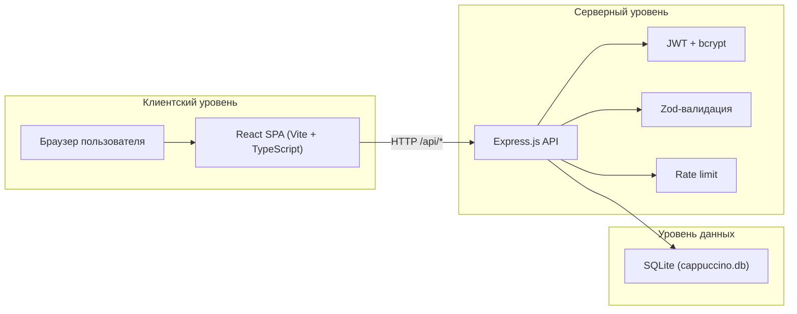

# Архитектура системы «Cappuccino»

## Общая схема (клиент — сервер — БД)

## Компоненты backend

| Модуль | Назначение |
|--------|------------|
| `server/src/routes/api.ts` | Маршруты REST API |
| `server/src/services/` | Бизнес-логика (брони, акции, авторизация) |
| `server/src/db/` | Подключение к SQLite, начальное заполнение |
| `server/src/middleware/` | JWT, валидация, обработка ошибок |
| `server/src/validators/` | Zod-схемы входных данных |

## Компоненты frontend

| Модуль | Назначение |
|--------|------------|
| `src/App.tsx` | Главная страница (меню, акции, бронирование) |
| `src/pages/AdminPage.tsx` | Панель администратора |
| `src/api/client.ts` | HTTP-клиент для API |

## Режимы развертывания

**Development:** Vite (:5173) проксирует `/api` → Express (:3001)

**Production:** `npm run build && npm start` — Express раздаёт `dist/` и API на порту 3001

## Безопасность

- Helmet — HTTP-заголовки безопасности
- CORS — ограничение origin
- JWT — доступ к админ-эндпоинтам
- bcrypt — хеширование пароля администратора
- Rate limit — защита от злоупотребления API
- Zod — валидация всех входящих данных
