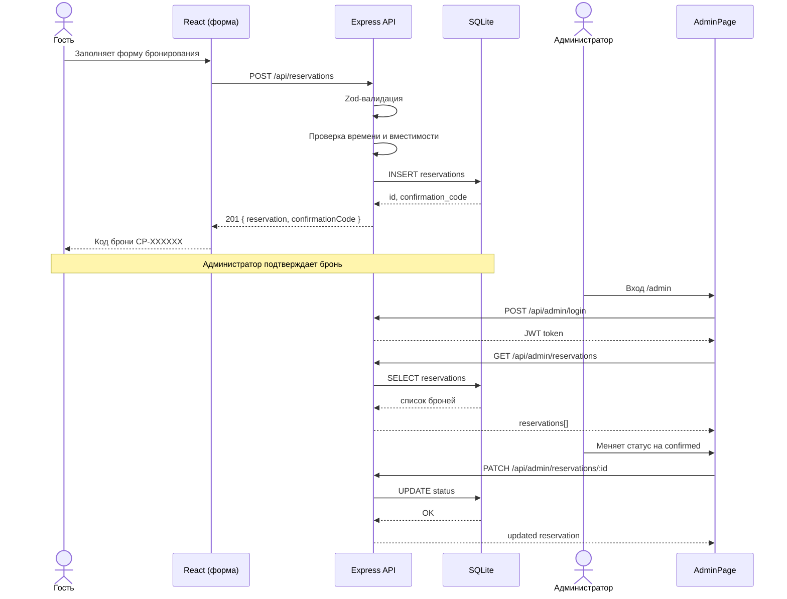

# Диаграмма последовательности: бронирование стола

```mermaid
sequenceDiagram
    actor Guest as Гость
    participant UI as React (форма)
    participant API as Express API
    participant DB as SQLite

    Guest->>UI: Заполняет форму бронирования
    UI->>API: POST /api/reservations
    API->>API: Zod-валидация
    API->>API: Проверка времени и вместимости
    API->>DB: INSERT reservations
    DB-->>API: id, confirmation_code
    API-->>UI: 201 { reservation, confirmationCode }
    UI-->>Guest: Код брони CP-XXXXXX

    Note over Guest,DB: Администратор подтверждает бронь

    actor Admin as Администратор
    participant AdminUI as AdminPage

    Admin->>AdminUI: Вход /admin
    AdminUI->>API: POST /api/admin/login
    API-->>AdminUI: JWT token
    AdminUI->>API: GET /api/admin/reservations
    API->>DB: SELECT reservations
    DB-->>API: список броней
    API-->>AdminUI: reservations[]
    Admin->>AdminUI: Меняет статус на confirmed
    AdminUI->>API: PATCH /api/admin/reservations/:id
    API->>DB: UPDATE status
    DB-->>API: OK
    API-->>AdminUI: updated reservation
```
