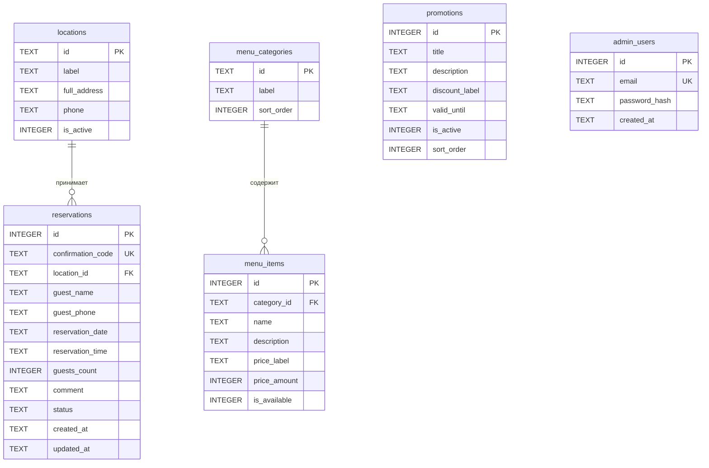

# ER-диаграмма базы данных

## Диаграмма «сущность — связь»

## Статусы бронирования

| status | Описание |
|--------|----------|
| pending | Ожидает подтверждения |
| confirmed | Подтверждена администратором |
| cancelled | Отменена |
| completed | Завершена (гость посетил) |

## Индексы

- `idx_reservations_date_time` — быстрый поиск занятости слотов
- `idx_reservations_status` — фильтрация в админ-панели
